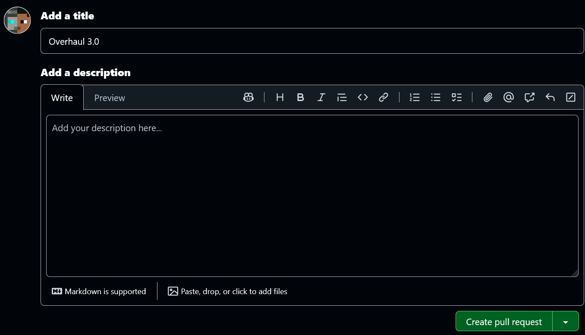

# New Pack

You want to create a new pack! This is the easiest one!

Ensure you have cloned [BEComTweaks/behaviour-packs](https://github.com/BEComTweaks/behaviour-packs), [BEComTweaks/crafting-tweaks](https://github.com/BEComTweaks/crafting-tweaks) or [BEComTweaks/resource-packs](https://github.com/BEComTweaks/resource-packs).

Open the newly cloned folder using VSCode. In the directory list, open the `jsons` folder, followed by the `packs` folder. You should now see a list of `.json` files. Click the json for the category that you want to add your pack to.

### JSON Format

The format for a pack is as follows


```json
{
  "pack_id": "<pack id>",
  "pack_name": "<pack name>",
  "pack_description": "<pack description>",
  "conflict": [
    "<pack ids>"
  ],
  "message": [
    "<level>",
    "<notes>"
  ],
  "icon": "<ext of icon>",
  "priority": "<int>",
  "regolith": "<bool>"
}
```


The only required definitions are `pack_id`, `pack_name` and `pack_description`. For the rest, they aren't required. Let's go through what each one defines.

#### Pack ID

* This defines a unique identifier for a given pack, used for loading selected packs from a URL, creation of a pack and defining conflicts.
* Must be a non-empty string and is required.

#### Pack Name

* This defines the name of the given pack, used in the website's UI, but has no other purpose in the backend.
* Must be a non-empty string and is required.

#### Pack Description

* This defines the description for the given pack, added as an explanation for the pack. No other purpose in the backend.
* Must be a string, but can be empty and is required.

#### Conflict

* This defines the list of packs that conflict with the current pack. This is used to warn the user of enabling such a pack with another pack. This has no purpose in the backend.
* Must be an array containing non-empty strings, but can be omitted.

#### Message

* An extra stylised description is used to provide additional information to the user. This has no purpose in the backend.
* Must be in the format below, but can be omitted


```json
"message": [
  "error/info/warn",
  "<information>"
]
```


* A message of level `error` has the information show up as <mark style="color:red;">red</mark>
* A message level of `info` has the information show up as <mark style="color:blue;">cyan</mark>
* A message level of `warn` has the information show up as <mark style="color:orange;">orange</mark>

#### Icon

* A setting to change the extension of the pack icon used. This means that pack icons added as a `WebP` or even `QOI` can be used. Added for `gif`, but preferred as `png`. This has no purpose in the backend.
* Must be a string that doesn't contain the period `.`, but can be omitted

#### Priority

* This defines the priority level of a pack, which refers to whether conflicting packs can overwrite the other in the occasion that a compatibility isn't available for it. This has no purpose in the frontend.
* Must be an integer lower than 999.

#### Regolith

* This defines whether the pack added is a pack that is required to be built using [Regolith](https://regolith-docs.readthedocs.io/). This has no purpose in the frontend.
* Must be a boolean.

With your selected options, insert the dictionary between one of the items inside the array.

### Folder

Now, back at the root directory where your repository is at, open the `packs` folder, followed by the category. If the category's json contains a key `"location"`, open the appropriate directory. Else, just open the category's directory. Inside there, create a new folder and name it `<pack id>` from your dictionary.

Inside it, copy and paste a template icon from `/pack_icons/` into the pack's folder and name it as `pack_icon.png` . Using an image editing software like MS Paint, Aseprite, Pixelorama, etc, make your pack icon.

After you have created the pack icon,&#x20;

* If you are using regolith, continue with initialising a regolith project.
* Else, create a new folder called `files` inside the pack and dump the pack (aside from `manifest.json` and `pack_icon.png`) inside the `files` folder.

### Checks

Now, using your terminal, head to the folder with the repository. Ensure that you have an active Python Virtual Environment (refer to [#setting-up-the-modules](../getting-started.md#setting-up-the-modules "mention") if you have not set it up). Run


```sh
python pys/pre_commit.py --format
```


You can choose to add in a `--no-stash` if you are sure you won't accidentally nuke your workspace.

After the script finishes running, you can run


```sh
git status
```


to see your changed files. If they are all right, you can run


```sh
git add .
```


to stage your added files, then


```sh
git commit -m "<message>"
```


where `<message>` is a summary of the changes you made. Finally, run

```sh
git push
```

to push the changes to the remote repository. Now check your repository in the web (the url from [#forking-the-repo](../getting-started.md#forking-the-repo "mention")). You should see your new commit message. You might also see a banner saying that you can create a new Pull Request. Click on it and you should see something like this

<figure><figcaption><p>Pull Request</p></figcaption></figure>

Add a title for your change, like `Added <pack> inside <category>` and a description (can be empty ~~like your heart~~)

Press `Create pull request` and you are done!
